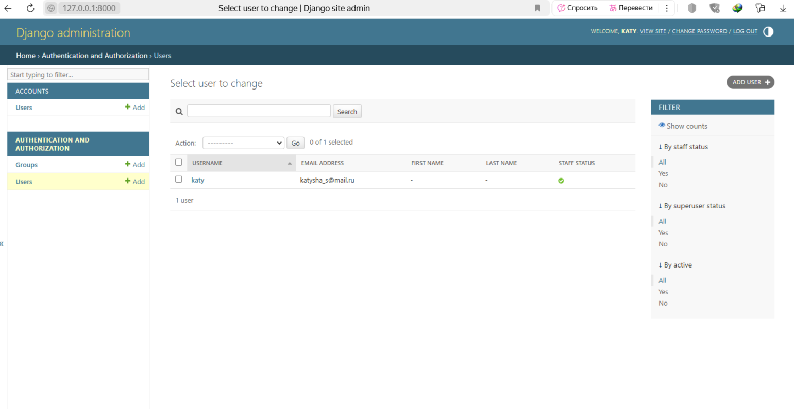

###  Задание: Создание приложения для регистрации пользователей
Создание проекта и приложения

Создайте новый проект Django с названием user_registration.

Создайте приложение accounts внутри проекта для работы с регистрацией пользователей.

Запустите сервер разработки, чтобы убедиться, что проект работает по адресу http://127.0.0.1:8000/.

Создание модели пользователя

В файле accounts/models.py создайте модель пользователя, которая будет содержать следующие поля:
username (имя пользователя, строка)
email (электронная почта, строка)
password (пароль, строка)

created_at (дата и время создания аккаунта, автоматически устанавливаемое)

Сгенерируйте миграцию для модели пользователя и примените ее

